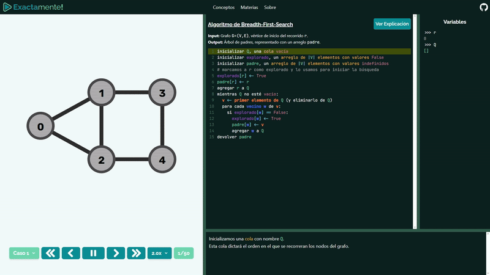
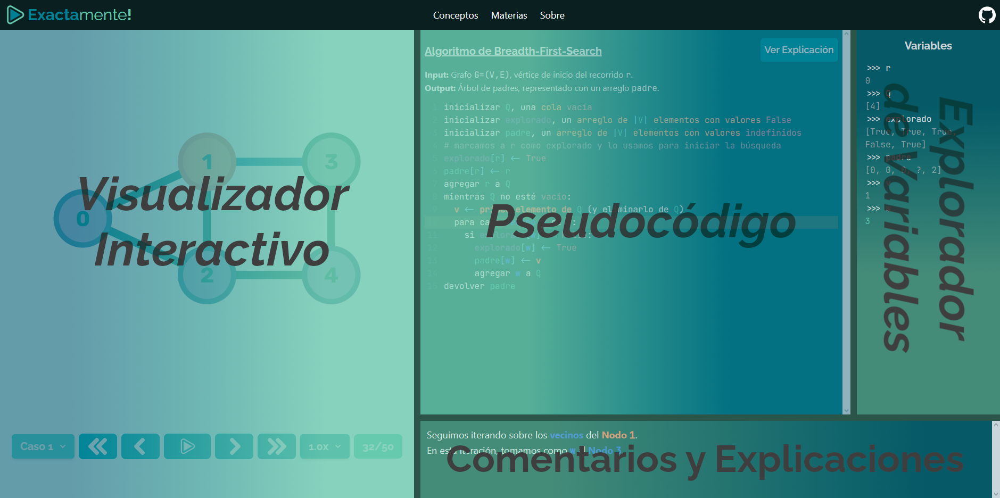

### *Exactamente!* es un recurso online de la FCEN para enseñar y aprender acerca de conceptos de computación a través de visualizaciones interactivas, pseudocódigo comentado, y explicaciones descriptivas.

### **https://exactamente.netlify.app/**

 

 

# Contribuciones
Por el momento *Exactamente!* está en una versión muy temprana de desarrollo, y **necesita de aportes para poder avanzar** a un estado que el estudiantado pueda usar cómodamente. Por ello, si te interesa el proyecto y sentís que puede ser útil para la cursada de muchos estudiantes de la carrera, ¡te pido que consideres ayudar como puedas! En la sección de [Contribuciones](./docs//CONTRIBUCIONES.md) podés ver de qué manera aportar. Además, podés consultar la [Ficha Técnica](./docs//FICHA_TECNICA.md) para ver información de cómo está estructurado el repositorio.

Cualquier aporte de código, notificación de errores o fallas, sugerencias o cualquier otro tipo de contribución será enormemente agradecida.

# (Futuras) Funcionalidades
* Explicaciones con imágenes y fórmulas de conceptos como:
  * Grafos
  * Programación Dinámica
  * Ordenamiento
  * Concurrencia
  * Algoritmos Golosos
  * Organización del Computador
  * y *(con suerte...)* muchos más! 
* Visualizador interactivo de algoritmos
  * Pseudocódigo claro y comentado
  * Explorador de variables
  * Ventana gráfica de visualización
  * Ejecución paso a paso o automática
  * Múltiples casos de visualización por concepto
* Listado del contenido, tanto por área general como por materia
* Totalmente gratuito, sin anuncios ni subscripciones

# Instalación y Uso Local
## Stack utilizado
El proyecto es en esencia una página web estática, escrita principalmente en HTML y JavaScript vanilla con algunas bibliotecas como [**Alpine.js**](https://alpinejs.dev/), [**HTMX**](https://htmx.org/) y [**D3.js**](https://d3js.org/). Los estilos se manejan utilizando [**TailwindCSS**](https://tailwindcss.com/). Se usa [**Python**](https://www.python.org/) para implementar algunas utilidades de desarrollo. Por último, con [**Node.js**](https://nodejs.org/en) se administran las dependencias de desarrollo. Para más detalles, ver la [ficha técnica](./docs/FICHA_TECNICA.md).

## Dependencias de Desarrollo
Al ser una página web estática, lo único estrictamente necesario para poder servir localmente el sitio es alguna utilidad capaz de servir localmente archivos estáticos. Si estás usando Visual Studio Code, recomiendo la extensión [Live Server](https://marketplace.visualstudio.com/items?itemName=ritwickdey.LiveServer).

Sin embargo, para editar cómodamente el proyecto, lo más recomendado es realizar la instalacion 

## Cómo Usar Localmente
1. **Clonar el repositorio y moverse a la carpeta de destino**
	
		$ git clone https://github.com/AugustoNicola/exactamente
		$ cd exactamente/src

2. **Instalar las dependencias de desarrollo**
	
		$ npm install
		
3. **Iniciar el servidor local**

	Este paso depende de cómo quieras servir los archivos locales. Es importante notar que el directorio base del sitio es `<...>/exactamente/src/public`, por lo que el servidor debe configurarse para que reconozca esa ruta como el recurso base `/`. Si estás usando Live Server, podés o bien abrir VS Code desde esa ruta, o bien especificarle a la extensión el directorio con la opción `"liveServer.settings.root": "/src/public"`.

4. **Iniciar el actualizador de estilos**

	
		$ npm run css

## Comandos
* `npm run css`: Inicia el actualizador de estilos, el cual actualiza los archivos apenas se hacen cambios de TailwindCSS. Sin esto corriendo los estilos podrían no actualizarse.
* `npm run minificar`: Aplica la utilidad `minificar.py` sobre todos los archivos en `src/casos/` y escribe los casos minificados resultantes en `src/public/assets/js/simulaciones/`.

# Licencia
Este proyecto está bajo la [Licencia MIT](https://choosealicense.com/licenses/mit/). **¡Podés leer, usar o modificar el código que necesites!**
